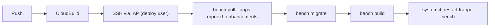

# Workflow Guide — Controlling Infrastructure with Variables

- [Architecture Overview](#architecture-overview)
- [Terraform Architecture — File Map & How It Works](#terraform-architecture)
- [1. Core Toggles — Which Services to Provision](#core-toggles)
- [2. VM Type & Location](#vm-type-location)
- [3. Networking & Public IP](#networking-public-ip)
- [4. Disks — Size, Type, Persistence](#disks)
- [5. Spot VM — Snapshots & Restore](#spot-vm-snapshots-restore)
- [6. Load Balancer & Health Checks](#load-balancer-health-checks)
- [7. IAP SSH Access (No Public IP Needed)](#iap-ssh-access)
- [8. CI/CD — Deploy on Push](#cicd-deploy-on-push)
- [9. Startup Script — What Runs on First Boot](#startup-script)
- [10. Labels](#labels)
- [11. Complete Variable Reference](#complete-variable-reference)
- [12. Common Scenarios](#common-scenarios)

---

Every aspect of this Terraform config is controlled through variables in
`terraform.tfvars`. Change a variable → `terraform apply` → GCP updates.

---

<a name="architecture-overview"></a>
## Architecture Overview

### What is being deployed

Two Frappe/ERPNext application VMs behind global load balancers, with CI/CD
pipeline and optional supporting services:

```
                         Internet
                            |
                    ┌───────┴───────┐
                    │  DNS (manual) │
                    └───────┬───────┘
                            |
              ┌─────────────┼─────────────┐
              │             │             │
     ┌────────┴────────┐   │   ┌────────┴────────┐
     │  Spot GLB       │   │   │  Production GLB │
     │  (spot-glb)     │   │   │(sapphire-glb)   │
     │  34.149.67.36   │   │   │ 136.68.113.208  │
     └────────┬────────┘   │   └────────┬────────┘
              │             │             │
     ┌────────┴────────┐   │   ┌────────┴────────┐
     │  Backend:       │   │   │  Backend:       │
     │  spot-vm        │   │   │  production-vm  │
     │  us-central1-a  │   │   │  us-east4-a     │
     └────────┬────────┘   │   └────────┬────────┘
              │             │             │
     ┌────────┴────────┐   │   ┌────────┴────────┐
     │  Spot VM        │   │   │  Standard VM    │
     │  (Test)         │   │   │  (Production)   │
     │  n2-standard-8  │   │   │  n2d-standard-8 │
     │  Debian 13      │   │   │  Debian 13      │
     └────────┬────────┘   │   └────────┬────────┘
              │             │             │
     ┌────────┴────────┐   │   ┌────────┴────────┐
     │  Boot: test-... │   │   │  Boot: prod-... │
     │  -boot-restored │   │   │  -boot-east4    │
     │  Data: test-... │   │   │  Data: prod-... │
     │  -data-restored │   │   │  -data-east4    │
     └─────────────────┘   │   └─────────────────┘
```

### Resource layout by region

| Resource | Location | Details |
|---|---|---|
| **Standard VM** (production) | `us-east4-a` | On-demand, `n2d-standard-8`, 50 GB boot + 200 GB data |
| **Spot VM** (test) | `us-central1-a` | Spot/preemptible, `n2-standard-8`, 50 GB boot + 200 GB data |
| **Spot GLB** | Global | `spot-glb`, IP `34.149.67.36`, backend → spot VM group |
| **Production GLB** | Global | `sapphire-glb`, IP `136.68.113.208`, backend → production VM group |
| **Cloud NAT** | `us-east4`, `us-east1`, `us-central1` | Outbound internet for private VMs |
| **Health check** | Global | `erpnext-standalone-health-check`, HTTP `:80/` |
| **Cloud Build triggers** | `us-east1` | 4 triggers: deploy-test, deploy-prod, upstream-test, upstream-prod |
| **Terraform state** | `us-central1` | GCS bucket `tf-state-v8` |

### Network layout

```
┌──────────────────────────────────────────────────────┐
│  VPC: sapphire-vpc (or default)                      │
│                                                      │
│  ┌─────────────────┐   ┌──────────────────────────┐  │
│  │ us-central1     │   │  us-east4                │  │
│  │ subnet/default  │   │  subnet/default          │  │
│  │                 │   │                          │  │
│  │ Spot VM         │   │  Production VM           │  │
│  │ 10.128.0.0/20  │   │  (different subnet CIDR) │  │
│  └────────┬────────┘   └─────────────┬────────────┘  │
│           │                          │               │
│           └──────────┬───────────────┘               │
│                      │                               │
│              IAP SSH (35.235.240.0/20)               │
│              LB probes (130.211.0.0/22)              │
└──────────────────────────────────────────────────────┘
```

Both VMs are **private** (no public IPs). Access is via **IAP SSH tunneling**
only. Outbound internet for package installs uses **Cloud NAT**.

### Services in use (by provision_* toggle)

| Toggle | Service | Status in this deployment |
|---|---|---|
| `provision_compute_vm` | Standard VM | ✅ Active (`production-erpnext-standard-vm`) |
| `provision_spot_vm` | Spot VM | ✅ Active (`test-erpnext-spot-vm`) |
| `provision_load_balancer` | Global HTTP LB | ✅ Active (2 LBs: spot + production) |
| `provision_spot_vm_lb_backend` | Spot VM in LB | ✅ Active |
| `provision_standard_vm_lb_backend` | Prod VM in LB | ✅ Active |
| `provision_cloud_build` | CI/CD triggers | ✅ Active (4 triggers) |
| `provision_ips` | Static IPs | ✅ Active |
| `provision_ssl` | SSL certificates | ✅ Active |
| `provision_cloud_nat` | Cloud NAT | ✅ Active (3 regions) |
| `provision_artifact_registry` | Artifact Registry | ❌ Disabled |
| `provision_cloud_run` | Cloud Run | ❌ Disabled |
| `provision_cloud_function` | Cloud Functions | ❌ Disabled |
| `provision_sql` | Cloud SQL | ❌ Disabled |
| `provision_prod_mig` | Prod MIG | ❌ Disabled |
| `provision_test_mig` | Test MIG | ❌ Disabled |

### How the pieces connect

```
Git Push (erpnext_enhancements repo)
       │
       ▼
Cloud Build trigger (deploy-test / deploy-prod)
       │
       ├── Read DEPLOY_SSH_KEY from Secret Manager
       ├── gcloud compute ssh deploy@VM --tunnel-through-iap
       │
       ▼
SSH into VM as deploy user
       │
       ├── sudo -u frappe bench pull --apps erpnext_enhancements
       ├── sudo -u frappe bench migrate
       ├── sudo -u frappe bench build
       └── sudo systemctl restart frappe-bench
              │
              ▼
       frappe-bench.service (systemd)
       ├── bench start → gunicorn (Frappe web server, port 8000)
       ├── nginx (reverse proxy, port 80)
       ├── redis-server (cache, queue)
       └── mariadb (database)
              │
              ▼
       Health check (port 80 → HTTP 200) → LB marks HEALTHY
```

### Data flow

```
User → DNS → GLB IP → Backend service → Instance group → VM
                                                           │
                                           ┌───────────────┼──────────────┐
                                           ▼               ▼              ▼
                                       nginx:80      bench:8000     mariadb
                                           │               │
                                           └───────┬───────┘
                                                   ▼
                                           frappe-bench service
                                           (gunicorn workers)
```

### Key security boundaries

1. **No public IPs** on VMs — all access goes through IAP or Load Balancer
2. **IAP tunnel** requires `roles/iap.tunnelResourceAccessor` IAM — not just
   knowing the VM name
3. **SSH key** for deploy is stored in Secret Manager, never in source code
4. **Firewall rules** only allow:
   - IAP proxy range (`35.235.240.0/20`) on port 22
   - LB health checker ranges on ports 80, 443, 8000
5. **Cloud Build SA** has IAP tunnel access — no persistent SSH keys needed

### Startup script flow (first boot only)

```
VM boots
   │
   ▼
Startup script runs (as root)
   │
   ├── Install APT packages (startup_script_packages)
   ├── Create deploy user
   ├── Add deploy to google-sudoers, frappe group
   ├── Write sudoers rule for deploy (systemctl restart)
   ├── Detect data disk by UUID (not device name)
   ├── Format & mount /data if not already
   ├── Add /data to fstab (by UUID)
   └── Done
```

The startup script uses **UUID** to identify the data disk, which means it
works correctly even when disk ordering changes after VM recreation in a
different zone.

---

<a name="terraform-architecture"></a>
## Terraform Architecture — File Map & How It Works

### File-by-file breakdown (`infra/`)

| File | Purpose |
|---|---|
| `providers.tf` | Provider config (Google, random) + remote state backend (GCS `tf-state-v8`) |
| `variables.tf` | All input variable definitions with types and defaults |
| `terraform.tfvars` | **Your values** — edit this file to change deployment |
| `outputs.tf` | Post-apply outputs (IPs, VM names, SSH keys, URLs) |
| `compute.tf` | VM instances (standard + spot), instance groups, health checks, firewall rules |
| `network.tf` | VPC (`sapphire-vpc` or `default`), subnet |
| `nat.tf` | Cloud NAT gateways (one per region for egress) |
| `load_balancer.tf` | Global HTTP(S) LBs, backend services, URL maps, target proxies, forwarding rules |
| `cloud_build.tf` | Cloud Build triggers (deploy-test/prod, upstream-test/prod), IAM, SSH key from Secret Manager |
| `ssl.tf` | SSL certificate via Certificate Manager module |
| `ips.tf` | Static global IP reservations |
| `iam.tf` | IAM bindings (service accounts, Cloud Build SA, deploy key permissions) |
| `mig.tf` | Managed Instance Group definitions (prod + test, optional) |
| `sql.tf` | Cloud SQL database instance (optional) |
| `cloud_run.tf` | Cloud Run service (optional) |
| `cloud_function.tf` | Cloud Function v2 (optional) |
| `artifact_registry.tf` | Artifact Registry Docker repo (optional) |
| `project.tf` | Project-level module call (IAM, org policies, logging, alerts) |

### Module structure (`modules/`)

| Module | What it manages |
|---|---|
| `modules/compute-vm/` | Instance, boot disk, attached disk, template, snapshot resource policies |
| `modules/project/` | Project services, IAM, org policies, VPC-SC, logging, alerts, quotas |
| `modules/secret-manager/` | Secrets (global + regional), IAM bindings |
| `modules/cloud-build-v2-connection/` | GitHub repo connection for Cloud Build v2 triggers |
| `modules/certificate-manager/` | SSL cert provisioning and DNS authorization |
| `modules/cloudsql-instance/` | SQL instance, database, user |
| `modules/cloud-run-v2/` | Cloud Run service, jobs, worker pools, VPC connector |
| `modules/cloud-function-v1/` / `modules/cloud-function-v2/` | Functions, bundle, VPC connector |
| `modules/artifact-registry/` | Docker repository, IAM |

### How the files link together

```
terraform.tfvars ──► variables.tf ──► *.tf (root module resources)
                    (defines types,     │
                     defaults)          ├── compute.tf ──► modules/compute-vm/
                                        ├── network.tf
                                        ├── load_balancer.tf
                                        ├── cloud_build.tf ──► modules/cloud-build-v2-connection/
                                        ├── ssl.tf ──► modules/certificate-manager/
                                        ├── sql.tf ──► modules/cloudsql-instance/
                                        ├── cloud_run.tf ──► modules/cloud-run-v2/
                                        ├── cloud_function.tf ──► modules/cloud-function-v2/
                                        ├── artifact_registry.tf ──► modules/artifact-registry/
                                        └── project.tf ──► modules/project/
                                               │
                                               ▼
                                         outputs.tf ◄── (reads resource attributes)
                                               │
                                               ▼
                                         terraform apply prints outputs
```

The dependency chain:
1. **variables.tf** declares all input variables
2. **terraform.tfvars** sets their values
3. Each `*.tf` resource/module block references `var.*` to configure itself
4. Resources reference each other via `google_*.*.id`, `module.*.output`, etc.
5. **outputs.tf** reads final resource attributes and prints them on apply
6. **providers.tf** configures Google provider with project/region and GCS backend for state

### Variable flow example

```hcl
# variables.tf
variable "vm_config" {
  type = object({
    machine_type = string
    zone         = string
    ...
  })
}

# terraform.tfvars
vm_config = {
  machine_type = "n2-standard-8"
  zone         = "us-central1-a"
  ...
}

# compute.tf
module "spot_vm" {
  source   = "./modules/compute-vm"
  vm_config = var.vm_config  # passes tfvars values to module
  ...
}

# modules/compute-vm/main.tf
resource "google_compute_instance" "this" {
  machine_type = var.vm_config.machine_type  # "n2-standard-8"
  zone         = var.vm_config.zone          # "us-central1-a"
  ...
}
```

### How to run Terraform

```bash
# 1. Navigate to infra directory
cd infra

# 2. Initialize (first time or after module changes)
terraform init

# 3. Validate syntax
terraform validate

# 4. Format code
terraform fmt

# 5. Review what will change
terraform plan

# 6. Apply (with approval prompt)
terraform apply

# 7. Or: safe apply (plan to file, review, apply)
terraform plan -out=tfplan
terraform apply tfplan

# 8. Destroy (tear down everything)
terraform destroy
```

### Common Troubleshooting

**"Backend GCS bucket doesn't exist"**
```
Initializing the backend...
Error: storage.NewWriter: googleapi: Error 404: The specified bucket does not exist.
```
→ Run `terraform init -reconfigure` after creating the bucket manually, or update `bucket` in `providers.tf`.

**"Error 403: Required 'compute.instances.create' permission"**
→ The account running Terraform needs `roles/compute.admin` (or equivalent). If using a service account, ensure it's granted at project level.

**"Error: Error creating instance: googleapi: Error 400: The resource 'projects/.../zones/us-central1-a/instances/...' already exists"**
→ State is out of sync. Run `terraform import google_compute_instance.<name> projects/<project>/zones/<zone>/instances/<name>` or `terraform refresh`.

**"Module has not declared variable"**
→ You passed a variable to a module that doesn't accept it. Check the module's `variables.tf` for the correct variable name and type.

**"Unsupported attribute" or "Missing required argument"**
→ A resource or module call references a variable or attribute that doesn't exist. Check `terraform validate` for exact line numbers.

**"Error acquiring the state lock"**
→ Another process holds the lock. Wait for it to finish, or force-unlock (only if you're sure no other apply is running):
```bash
terraform force-unlock <LOCK_ID>
```

**"terraform apply says no changes but I edited tfvars"**
→ Run `terraform plan` first to see what will change. If it still says no changes, check that your variable is actually referenced by a resource condition (e.g., `count = var.provision_spot_vm ? 1 : 0`).

**"Snapshot resource policy not attaching to disk"**
→ If the disk is created via `source = "attach"`, the module must resolve the disk URL to a short name. Check `modules/compute-vm/resource-policies.tf` for `reverse(split("/", ...))[0]` logic.

**"Disk UUID changes after VM move to different zone"**
→ This is expected. The startup script detects the data disk by UUID, not device name. If you see mount failures, check `/etc/fstab` for stale UUIDs and run `sudo blkid` to find the current one.

**"Cloud Build trigger fails with permission denied"**
→ Make sure the Cloud Build SA has `roles/iap.tunnelResourceAccessor` and `roles/compute.osLoginExternalUser`. Also verify the deploy SSH key secret exists in Secret Manager with the correct name.

**"terraform plan/apply very slow"**
→ The `google_compute_disk` resource with `snapshot` source can be slow. Use `lifecycle { ignore_changes = [snapshot] }` on disks that should not be recreated. Already applied to restored disks.

**"I want to see what resources exist without applying"**
```bash
terraform show        # show state
terraform state list  # list all resources in state
terraform output      # show outputs only
```

---

<a name="core-toggles"></a>
## 1. Core Toggles — Which Services to Provision

Set these to `true` or `false` to turn services on/off:

| Variable | What it controls |
|---|---|
| `provision_compute_vm` | Standard (production) VM instance |
| `provision_spot_vm` | Spot (test) VM — cheaper, can be preempted |
| `provision_load_balancer` | Global HTTP(S) load balancer |
| `provision_cloud_build` | CI/CD triggers (deploy + upstream) |
| `provision_ips` | Static IP addresses |
| `provision_ssl` | SSL certificate via Certificate Manager |
| `provision_cloud_run` | Cloud Run service |
| `provision_cloud_function` | Cloud Function v2 |
| `provision_sql` | Cloud SQL database |
| `provision_artifact_registry` | Artifact Registry Docker repo |
| `provision_cloud_nat` | Cloud NAT gateways for outbound traffic |
| `provision_prod_mig` | Production Managed Instance Group |
| `provision_test_mig` | Test Managed Instance Group |

Example — provision only the spot VM with no load balancer:
```hcl
provision_spot_vm    = true
provision_compute_vm = false
provision_load_balancer = false
```

---

<a name="vm-type-location"></a>
## 2. VM Type & Location

| Variable | What it does | Default |
|---|---|---|
| `compute_machine_type` | Machine type for the standard VM | `n2d-standard-8` |
| `spot_machine_type` | Machine type for the spot VM | `n2d-standard-8` |
| `vm_region` | Region for standard VM (null = use `region`) | `null` |
| `vm_zone` | Exact zone for standard VM (overrides region) | `null` |
| `spot_vm_region` | Region for spot VM (null = use `region`) | `null` |
| `spot_vm_zone` | Exact zone for spot VM (overrides region) | `null` |
| `standard_vm_name` | Name of the standard VM | `standard-vm` |
| `spot_vm_name` | Name of the spot VM | `spot-vm` |

Set exact zones for both VMs:
```hcl
vm_zone      = "us-east4-a"
spot_vm_zone = "us-central1-a"
```

---

<a name="networking-public-ip"></a>
## 3. Networking & Public IP

| Variable | What it does | Default |
|---|---|---|
| `network` | VPC network name | `default` |
| `subnetwork` | Subnet name | `default` |
| `use_default_vpc` | Use GCP's auto-created default VPC | `false` |
| `ip_external` | Master toggle for public/private IPs | `false` |
| `enable_standard_public_ip` | Give the standard VM a public IP | `false` |
| `enable_spot_public_ip` | Give the spot VM a public IP | `false` |

**Typical setup**: VMs are private, accessed only via IAP SSH tunneling.
```hcl
network                = "my-vpc"
subnetwork             = "my-subnet"
enable_standard_public_ip = false
enable_spot_public_ip     = false
```

---

<a name="disks"></a>
## 4. Disks — Size, Type, Persistence

| Variable | What it does | Default |
|---|---|---|
| `vm_boot_disk_size` | Boot disk size in GB | `50` |
| `vm_data_disk_size` | Data disk size in GB | `200` |
| `disk_type` | Disk type (`pd-balanced`, `pd-ssd`, `pd-standard`) | `pd-balanced` |
| `reuse_existing_disks` | Make boot disk an independent resource (persists across VM recreation) | `false` |
| `boot_disk_auto_delete` | Auto-delete boot disk when VM is deleted | `false` |
| `vm_local_ssd_count` | Number of local SSD scratch disks | `1` |
| `local_ssd_size` | Size of each local SSD in GB | `375` |
| `boot_disk_source_attach` | Self-link of an existing disk to use as boot disk | `null` |
| `data_disk_source_attach` | Self-link of an existing disk to use as data disk | `null` |
| `vm_custom_image` | Custom image for boot disk (e.g. from a snapshot) | `null` |

**Persistent disks** (data survives VM recreate):
```hcl
reuse_existing_disks = true
boot_disk_auto_delete = false
vm_boot_disk_size    = 50
vm_data_disk_size    = 200
disk_type            = "pd-balanced"
```

**Attach existing disks** (e.g. migrated from another zone):
```hcl
boot_disk_source_attach = "projects/<PROJECT>/zones/<ZONE>/disks/<DISK_NAME>"
data_disk_source_attach = "projects/<PROJECT>/zones/<ZONE>/disks/<DISK_NAME>"
```

---

<a name="spot-vm-snapshots-restore"></a>
## 5. Spot VM — Snapshots & Restore

### Automated Daily Snapshots

Set `enable_spot_vm_snapshot_schedule = true` to automatically snapshot
both the boot and data disk every day.

| Variable | What it does | Default |
|---|---|---|
| `enable_spot_vm_snapshot_schedule` | Enable daily snapshots | `null` |
| `snapshot_schedule_start_time` | UTC time to run (HH:MM) | `02:00` |
| `snapshot_schedule_retention_days` | How many days to keep snapshots | `7` |
| `snapshot_schedule_storage_location` | GCS region for snapshots (`us`, `us-east1`, etc.) | `us` |

### Restore from Snapshot

When a spot VM is preempted and recreated in a different zone:

1. Set `restore_spot_vm_from_snapshot = true`
2. Run `terraform apply`
3. Terraform finds the latest snapshot for each disk, creates new disks
   from them, and attaches them to the new VM.

**After first restore**: The VM uses persistent "restored" disks named
`<vm-name>-boot-restored` and `<vm-name>-data-restored`.
`restore_spot_vm_from_snapshot` can be toggled freely — it won't destroy disks.

**To restore from a newer snapshot**:
```bash
terraform taint google_compute_disk.spot_boot_from_snapshot[0]
terraform taint google_compute_disk.spot_data_from_snapshot[0]
terraform apply
```

---

<a name="load-balancer-health-checks"></a>
## 6. Load Balancer & Health Checks

| Variable | What it does | Default |
|---|---|---|
| `provision_spot_vm_lb_backend` | Register spot VM as LB backend | `false` |
| `provision_standard_vm_lb_backend` | Register standard VM as LB backend | `false` |
| `health_check_port` | Port the health check probes | `80` |
| `health_check_request_path` | URL path for health probes | `/` |
| `health_check_interval_sec` | Seconds between probes | `10` |
| `health_check_timeout_sec` | Probe timeout | `5` |
| `health_check_healthy_threshold` | Successes needed to mark healthy | `2` |
| `health_check_unhealthy_threshold` | Failures needed to mark unhealthy | `3` |

**Example — quick detection** (aggressive health checking):
```hcl
health_check_interval_sec      = 5
health_check_timeout_sec       = 3
health_check_healthy_threshold = 1
health_check_unhealthy_threshold = 2
```

### Firewall Rules for Load Balancer

| Variable | What it does | Default |
|---|---|---|
| `lb_firewall_ports` | Ports opened to LB probes (`["80","443"]`) | `["80","443","8000"]` |
| `lb_source_ranges` | LB probe source IPs | `["130.211.0.0/22","35.191.0.0/16"]` |
| `enable_lb_firewall` | Create the LB firewall rule | `true` |

---

<a name="iap-ssh-access"></a>
## 7. IAP SSH Access (No Public IP Needed)

| Variable | What it does | Default |
|---|---|---|
| `iap_source_range` | Source IP range for IAP proxy | `35.235.240.0/20` |
| `enable_iap_ssh_firewall` | Create IAP firewall rule | `true` |
| `iap_tunnel_members` | Users granted IAP tunnel access | `[]` |

Grant tunnel access to your team:
```hcl
iap_tunnel_members = [
  "user:alice@example.com",
  "user:bob@example.com",
  "group:devops@example.com",
]
```

Connect to a VM:
```bash
gcloud compute ssh <VM_NAME> --zone <ZONE> --tunnel-through-iap
```

---

<a name="cicd-deploy-on-push"></a>
## 8. CI/CD — Deploy on Push

When `provision_cloud_build = true`, Terraform creates:

1. **SSH key pair** (`tls_private_key.deploy_ssh_key`) — private key stored in
   Secret Manager (`DEPLOY_SSH_KEY`).
2. **4 Cloud Build triggers**:
   - `deploy-test` — on push, deploy `erpnext_enhancements` to test VM
   - `deploy-prod` — on push, deploy to prod VM
   - `upstream-test` — manual or scheduled upstream update on test VM
   - `upstream-prod` — manual or scheduled upstream update on prod VM
3. **IAP tunnel grant** for Cloud Build SA.

### One-time manual step after first apply

You must add the deploy SSH public key to project metadata so VMs accept it:
```bash
gcloud compute project-info add-metadata \
  --metadata="ssh-keys=deploy:$(terraform -chdir=infra output -raw deploy_ssh_public_key)"
```

### Cloud Build YAML files

| Variable | Path in repo | Purpose |
|---|---|---|
| `cloudbuild_yaml_path` | `infra/cloudbuild.yaml` | Infra CI/CD |
| `cloudbuild_deploy_yaml_path` | `infra/cloudbuild-deploy.yaml` | Deploys only `erpnext_enhancements` app |
| `cloudbuild_upstream_yaml_path` | `infra/cloudbuild-upstream.yaml` | Updates all upstream Frappe apps |

If you move the YAML files, update the path variables:
```hcl
cloudbuild_deploy_yaml_path   = "ci/cloudbuild-deploy.yaml"
cloudbuild_upstream_yaml_path = "ci/cloudbuild-upstream.yaml"
```

### What the deploy pipeline does



**Test VM is a spot VM** — if it's preempted when a deploy triggers,
the pipeline checks status. If `_ALLOW_SKIP=true` (set in trigger substitution),
it exits gracefully with no error.

---

<a name="startup-script"></a>
## 9. Startup Script — What Runs on First Boot

| Variable | What it does | Default |
|---|---|---|
| `enable_startup_script` | Attach startup script to VMs | `false` |
| `startup_script_packages` | APT packages to install | curl, git, nginx, python3, etc. |
| `deploy_user` | Username for CI/CD SSH access | `deploy` |
| `deploy_user_sudo_command` | Sudo command allowed for deploy user | `systemctl restart frappe-bench` |

The startup script (`configs/startup_script.sh`) is rendered as a template —
variables like `deploy_user`, `startup_script_packages` are interpolated at
deployment time.

---

<a name="labels"></a>
## 10. Labels

| Variable | What it does | Default |
|---|---|---|
| `vm_labels` | Labels on the standard VM | `{role = "web-frontend"}` |
| `spot_vm_labels` | Labels on the spot VM | `{role = "batch-processor"}` |

```hcl
vm_labels = {
  environment = "production"
  team        = "backend"
  cost-center = "erp"
}
```

---

<a name="complete-variable-reference"></a>
## 11. Complete Variable Reference

All variables are defined in `variables.tf` with full descriptions and types.
Quick reference by category:

### Provisioning toggles
`provision_artifact_registry`, `provision_cloud_build`, `provision_cloud_function`,
`provision_cloud_run`, `provision_compute_vm`, `provision_iam`, `provision_ips`,
`provision_load_balancer`, `provision_spot_vm`, `provision_sql`, `provision_ssl`,
`provision_prod_mig`, `provision_test_mig`, `provision_spot_vm_lb_backend`,
`provision_standard_vm_lb_backend`, `provision_cloud_nat`

### VM specs
`compute_machine_type`, `spot_machine_type`, `standard_vm_name`, `spot_vm_name`,
`vm_region`, `vm_zone`, `spot_vm_region`, `spot_vm_zone`

### VM features
`enable_vm_persistence`, `enable_startup_script`, `vm_network_tags`,
`spot_vm_network_tags`, `vm_ip_external`, `enable_standard_public_ip`,
`enable_spot_public_ip`, `restore_spot_vm_from_snapshot`

### Disks
`vm_boot_disk_size`, `vm_data_disk_size`, `disk_type`, `reuse_existing_disks`,
`boot_disk_auto_delete`, `vm_local_ssd_count`, `local_ssd_size`,
`boot_disk_source_attach`, `data_disk_source_attach`, `vm_custom_image`

### Health checks
`health_check_port`, `health_check_interval_sec`, `health_check_timeout_sec`,
`health_check_healthy_threshold`, `health_check_unhealthy_threshold`,
`health_check_request_path`, `enable_standalone_health_check`,
`enable_lb_firewall`

### Firewall
`lb_firewall_ports`, `lb_source_ranges`, `iap_source_range`,
`enable_iap_ssh_firewall`, `iap_tunnel_members`

### Network
`network`, `subnetwork`, `use_default_vpc`, `nat_regions`, `nat_name_prefix`

### Cloud Build / CI/CD
`cloudbuild_yaml_path`, `cloudbuild_deploy_yaml_path`,
`cloudbuild_upstream_yaml_path`, `deploy_branch_regex`, `destroy_branch_regex`,
`cloud_build_connection`, `cloud_build_github_token`,
`cloud_build_installation_id`, `cloud_build_repo_uri`

### SSL
`ssl_cert_name`, `ssl_map_name`, `domain_name`

### IP naming
`web_ip_name`, `glb_ip_name`, `spot_glb_ip_name`

### LB naming
`spot_lb_name`, `production_lb_name`

### NEG naming
`standalone_vm_neg_name`, `spot_vm_neg_name`

### Cloud SQL
`sql_db_version`, `sql_tier`

### Cloud Run
`cloud_run_image`, `api_url`, `cloud_run_service_name`

### Cloud Function
`cloud_function_bucket`

### Secrets
`secret_manager_secret_id`, `github_token_secret`, `github_app_installation_id`,
`github_repo_url`

### State
`state_bucket_name`, `state_bucket_region`

### Project
`project_id`, `billing_account_id`, `create_project`, `prefix`, `region`,
`ip_external`

### Labels
`vm_labels`, `spot_vm_labels`

### Startup script
`startup_script_packages`, `deploy_user`, `deploy_user_sudo_command`

### Snapshots
`enable_spot_vm_snapshot_schedule`, `snapshot_schedule_start_time`,
`snapshot_schedule_retention_days`, `snapshot_schedule_storage_location`

### IAM sub-toggles
`provision_iam_artifact_registry`, `provision_iam_cloud_build`,
`provision_iam_secret_manager`, `provision_iam_sql`

### MIG & autoscaling
`provision_prod_mig`, `provision_test_mig`, `use_zonal_mig`, `use_regional_mig`,
`prod_mig_machine_type`, `test_mig_machine_type`,
`prod_mig_zone`, `test_mig_zone`,
`enable_prod_autoscaling`, `enable_test_autoscaling`,
`prod_autoscaling_max_replicas`, `test_autoscaling_max_replicas`,
`mig_data_disk_size`, `mig_local_ssd_count`, `mig_health_check_port`

---

<a name="common-scenarios"></a>
## 12. Common Scenarios

### "I only want a spot test VM with no load balancer"

```hcl
provision_spot_vm  = true
provision_compute_vm = false
provision_load_balancer = false
provision_ips      = false
provision_ssl      = false
provision_cloud_build = false
```

### "I need the spot VM in a different zone after preemption"

```hcl
spot_vm_zone = "us-west1-a"
restore_spot_vm_from_snapshot = true
```
Then `terraform apply`. The VM will be recreated from the latest snapshot in
us-west1-a.

### "I want daily automated backups of the spot VM"

```hcl
enable_spot_vm_snapshot_schedule = true
snapshot_schedule_start_time     = "03:00"
snapshot_schedule_retention_days = 14
```

### "I want CI/CD — auto-deploy on every push"

```hcl
provision_cloud_build = true
iap_tunnel_members    = ["user:me@example.com"]
```
After apply, add the deploy key to project metadata (see section 8).

### "I want the load balancer to detect failures faster"

```hcl
health_check_interval_sec      = 5
health_check_healthy_threshold = 1
health_check_unhealthy_threshold = 2
health_check_timeout_sec       = 3
```

### "I want to attach existing disks (migrated from another zone)"

```hcl
boot_disk_source_attach = "projects/my-project/zones/us-east4-a/disks/prod-boot"
data_disk_source_attach = "projects/my-project/zones/us-east4-a/disks/prod-data"
reuse_existing_disks    = true
```

### "I want to recreate the spot VM from a fresh image (no snapshot)"

Switch `restore_spot_vm_from_snapshot` to `false`. The VM will be recreated
from the base OS image (e.g. Debian 13) with a blank data disk:

```hcl
restore_spot_vm_from_snapshot = false
```

Existing snapshot-based disks (`*-boot-restored`, `*-data-restored`) will be
destroyed and replaced with fresh ones.

### "I want to grant IAP SSH access to a new teammate"

Add their email to `iap_tunnel_members` and re-apply:

```hcl
iap_tunnel_members = [
  "user:alice@example.com",
  "user:bob@example.com",     # newly added
]
```

They can now connect:
```bash
gcloud compute ssh <VM_NAME> --zone <ZONE> --tunnel-through-iap
```

### "I want to upgrade the VM to a bigger machine type"

Change the machine type variable and re-apply. The VM will be stopped and
restarted with the new type:

```hcl
compute_machine_type = "n2d-standard-16"   # was n2d-standard-8
spot_machine_type    = "n2d-standard-16"   # 16 vCPUs, 64 GB RAM
```

**Note**: Some changes (like machine type) can be applied without recreating
the VM if `allow_stopping_for_update = true` (the default).

### "I want to temporarily give the VM a public IP for debugging"

```hcl
enable_spot_public_ip     = true
enable_standard_public_ip = true
```

After debugging, set them back to `false` to remove public IPs.

### "I want to destroy everything and start over"

```bash
terraform destroy
```

This deletes all provisioned resources. To recreate from scratch, just run
`terraform apply` again afterward.

**Warning**: This destroys disks too. If you want to preserve data,
set `boot_disk_auto_delete = false` and `reuse_existing_disks = true`
before destroying, then manually detach or snapshot disks first.

### "How do I SSH into a private VM?"

Since VMs have no public IP by default, use IAP tunneling:

```bash
gcloud compute ssh test-erpnext-spot-vm \
  --zone us-central1-a \
  --tunnel-through-iap
```

**Prerequisites**:
1. Your user must be in `iap_tunnel_members` in terraform.tfvars
2. The `iap.googleapis.com` API must be enabled (it's included in `base_apis`)

### "The disk is getting full — how do I increase size?"

Increase the size variables and re-apply. Terraform will expand the disk
in-place without data loss:

```hcl
vm_boot_disk_size = 100     # was 50 GB
vm_data_disk_size = 500     # was 200 GB
```

**After apply**, you still need to resize the filesystem inside the VM:
```bash
gcloud compute ssh <VM> --zone <ZONE> --tunnel-through-iap \
  --command="sudo resize2fs /dev/sda1"
```

### "I want to toggle the snapshot schedule on/off"

```hcl
enable_spot_vm_snapshot_schedule = false   # disable
enable_spot_vm_snapshot_schedule = true    # re-enable
```

Toggling this variable does **not** recreate the VM — it only attaches or
detaches the snapshot schedule policy from both disks.

### "I want to set up everything from scratch (new GCP project)"

```hcl
create_project      = true
project_id          = "my-brand-new-project"
billing_account_id  = "XXXXXX-YYYYYY-ZZZZZZ"
```

Terraform will create the project, enable all required APIs, and provision
all services inside it.

### "I want to use a custom VPC instead of the default one"

```hcl
use_default_vpc = false
network         = "my-custom-vpc"
subnetwork      = "my-custom-subnet"
```

The custom VPC/subnet must already exist in your project. The infra does not
create VPCs — it uses existing ones.

### "I want to use a custom boot image (e.g. a pre-baked snapshot)"

```hcl
vm_custom_image = "projects/my-project/global/images/frappe-bench-v1"
```

The VM will boot from this custom image instead of the default Debian 13.

### "I want to attach a data disk to the VM"

Set `enable_vm_persistence = true` to provision and attach a persistent data
disk to the VM:

```hcl
enable_vm_persistence = true
vm_data_disk_size     = 500     # 500 GB data disk
```

The data disk is mounted at `/data` on boot via the startup script.

### "Network tags aren't working — how do firewall rules target my VM?"

The VMs get their tags from `vm_network_tags` and `spot_vm_network_tags`.
Firewall rules target these tags. For example, the LB firewall rule
`allow-lb-to-production-vm` targets the `web-frontend` tag:

```hcl
vm_network_tags = ["web-frontend", "prod-loadbalancer-target"]
spot_vm_network_tags = ["web-frontend", "test-loadbalancer-target"]
```

If you change the tags, the firewall rules will still target the old tags
unless you also update the firewall rule's `target_tags`. This config does
not parameterize the firewall target tags — they are hardcoded to
`web-frontend`. Create a custom firewall rule if you need different tags.

### "How do I enable Cloud NAT for outbound internet?"

Cloud NAT is enabled by default (`provision_cloud_nat = true`). It allows
private VMs to reach the internet for package downloads, API calls, etc.

Control which regions get NAT gateways:
```hcl
nat_regions    = ["us-central1", "us-east1", "us-west1"]
nat_name_prefix = "myapp"
```

To disable NAT entirely:
```hcl
provision_cloud_nat = false
```

**Note**: Without NAT, private VMs cannot reach external URLs
(e.g. `apt-get`, `pip install`, GitHub, Docker Hub).

### "The startup script didn't run — how do I re-run it on an existing VM?"

The startup script only runs on **first boot**. To re-run it on a running VM:

```bash
# Copy the script from your local configs directory
gcloud compute scp configs/startup_script.sh <VM>:/tmp/startup.sh \
  --zone <ZONE> --tunnel-through-iap

# Run it as root
gcloud compute ssh <VM> --zone <ZONE> --tunnel-through-iap \
  --command="sudo bash /tmp/startup.sh"
```

### "I want to manually trigger a Cloud Build deploy pipeline"

```bash
# Deploy to test VM
gcloud builds triggers run deploy-test --region=us-east1 \
  --branch=main

# Deploy to prod VM
gcloud builds triggers run deploy-prod --region=us-east1 \
  --branch=main

# Update upstream apps on test
gcloud builds triggers run upstream-test --region=us-east1 \
  --branch=main
```

The triggers use the substitutions defined in `cloud_build.tf`
(`_VM_NAME`, `_VM_ZONE`, `_ALLOW_SKIP`).

### "I want to change the deploy user's sudo command"

The deploy user needs sudo to restart the frappe-bench service. If you change
the systemd service name or need a different command:

```hcl
deploy_user_sudo_command = "/usr/bin/systemctl restart my-custom-service"
```

This is written to `/etc/sudoers.d/deploy-bench` on first boot by the startup
script. On existing VMs, update it manually:
```bash
gcloud compute ssh <VM> --zone <ZONE> --tunnel-through-iap \
  --command="echo 'deploy ALL=(ALL) NOPASSWD: /usr/bin/systemctl restart my-custom-service' | sudo tee /etc/sudoers.d/deploy-bench"
```

### "Which public IP variable should I use?"

There are 3 overlapping variables — here's how they work:

| Variable | Scope | Default | When to use |
|---|---|---|---|
| `ip_external` | **Global** toggle for all services | `false` | Master switch — affects IPs, SQL, Cloud Run ingress |
| `vm_ip_external` | **All VMs** (standard, spot, MIG) | `null` | Falls back to `ip_external` if null. Set to override all VMs at once |
| `enable_standard_public_ip` | **Standard VM only** | `false` | Give just the prod VM a public IP |
| `enable_spot_public_ip` | **Spot VM only** | `false` | Give just the test VM a public IP |

If you set `vm_ip_external = true`, both VMs get public IPs regardless of
the individual toggles. If `vm_ip_external` is `null` (default), each VM
respects its own toggle.

### "Terraform apply failed halfway — what do I do?"

Don't panic. Terraform state is preserved even if the apply fails.

```bash
# 1. See what failed
terraform plan
# The plan will show what's left to create vs what already exists

# 2. Fix the issue (quota, permission, name conflict, etc.)

# 3. Run apply again — Terraform picks up where it left off
terraform apply
```

Common failures:
- **Quota exceeded**: Request more quota in GCP Console, then re-apply
- **Name conflict**: A resource with that name already exists. Change the name
  variable or delete the conflicting resource
- **Permission denied**: Ensure your Terraform SA has the required roles
- **State locked**: Run `terraform force-unlock <LOCK_ID>` if a previous run
  crashed and left a stale lock

### "I want to force recreate just the spot VM without affecting other resources"

Use `terraform taint` to mark a resource for recreation on the next apply:

```bash
# Recreate the spot VM
terraform taint 'module.spot_vm["test-erpnext-spot-vm"].google_compute_instance.default[0]'

# Also recreate from latest snapshot (see section 5)
terraform taint google_compute_disk.spot_boot_from_snapshot[0]
terraform taint google_compute_disk.spot_data_from_snapshot[0]

terraform apply
```

To recreate the standard VM:
```bash
terraform taint 'module.compute_vm["production-erpnext-standard-vm"].google_compute_instance.default[0]'
terraform apply
```

### "How do I delete just the spot (test) VM without touching production?"

Set the spot VM toggle to `false` and re-apply. Everything else stays:

```hcl
provision_spot_vm = false
```

This destroys:
- The spot VM instance
- Both disks (`-boot-restored`, `-data-restored`)
- The instance group
- Snapshot schedule policies

The standard (production) VM and load balancer are unaffected.

**To also remove the LB backend** (if you no longer need it):
```hcl
provision_spot_vm            = false
provision_spot_vm_lb_backend = false
```

### "How do I create a spot VM from scratch?"

Just set the toggle to `true` and configure it:

```hcl
provision_spot_vm            = true
provision_spot_vm_lb_backend = true    # optional: register in LB

spot_vm_name      = "my-test-vm"
spot_machine_type = "n2-standard-4"
spot_vm_region    = "us-central1"
# spot_vm_zone    = "us-central1-a"    # optional: pin to exact zone

enable_startup_script = true           # runs bench setup on first boot
```

Then:
```bash
terraform plan   # review what will be created
terraform apply  # provision the VM
```

The startup script installs Frappe/Bench, configures nginx, and attaches the
data disk. After the first boot, you can SSH in and finish setup.

### "How do I delete both VMs and the load balancer but keep everything else?"

```hcl
provision_compute_vm             = false
provision_spot_vm                = false
provision_spot_vm_lb_backend     = false
provision_standard_vm_lb_backend = false
provision_load_balancer          = false
provision_ips                    = false
provision_ssl                    = false
```

After `terraform apply`, only non-VM services remain (Cloud Build, NAT,
Cloud SQL, etc.).

### "I want to switch reuse_existing_disks from true back to false"

**Changing `reuse_existing_disks` from `true` → `false`** destroys the
independent boot disk resource and creates a new inline one. Data on the
boot disk is lost. Data disk is unaffected.

**Changing from `false` → `true`** detaches the inline boot disk and creates
a new independent disk. The old inline disk becomes an orphan — delete it
manually:
```bash
gcloud compute disks delete <VM-NAME>-boot --zone <ZONE>
```

**Recommendation**: Once you set `reuse_existing_disks = true`, leave it
there. It's the safer, production-grade setting.

### "I want to update the startup script packages"

Just change the list and re-apply. The startup script only runs on **first
boot**, so existing VMs won't be affected. To apply changes to a running VM,
you must re-run the script manually or recreate the VM:

```hcl
startup_script_packages = [
  "curl", "git", "nginx", "python3", "python3-pip",
  "python3-venv", "pipx", "redis-server", "mariadb-server"
]
```

For existing VMs, SSH in and install manually:
```bash
gcloud compute ssh <VM> --zone <ZONE> --tunnel-through-iap \
  --command="sudo apt-get update && sudo apt-get install -y redis-server"
```

### "How do I run terraform safely?"

Always follow this workflow:

```bash
# 1. See what will change
terraform plan

# 2. Review the output carefully
#    - "0 to destroy" is usually safest
#    - "to destroy" on disks or VMs means data loss

# 3. If plan looks correct, save it and apply
terraform plan -out=tfplan
terraform apply tfplan

# 4. Verify everything is healthy
gcloud compute instances list
gcloud compute backend-services get-health <LB_NAME> --global
```
